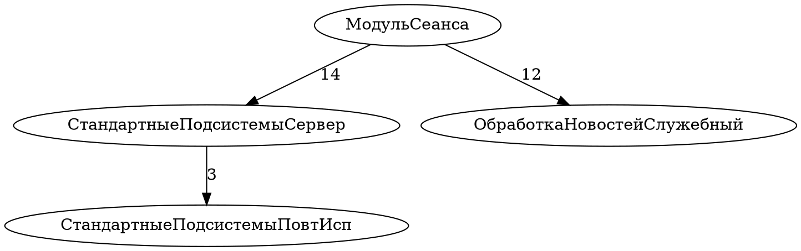

# EDT Debug Tracer — Next Steps

Все значения параметров — в конфигурационном файле `{workspace}/.edt-debug-tracer/tracer.properties`. Зашивать значения в код — антипаттерн.

---

## Приоритет 1: Обогащение данных

### 1.1 Заполнение поля `module`

Сейчас `module` пустой. Заполнить через `ISourceLocator`:

```java
ILaunch launch = thread.getLaunch();
ISourceLocator locator = launch.getSourceLocator();
if (locator != null) {
    Object src = locator.getSourceElement(frame);
    module = src != null ? src.toString() : "";
}
```

**Конфигурация:**
```properties
capture.module.enabled=true
capture.module.fallback=unknown
```

| Параметр | Тип | По умолчанию | Описание |
|----------|-----|-------------|----------|
| `capture.module.enabled` | boolean | `true` | Включить захват module через ISourceLocator |
| `capture.module.fallback` | string | `""` | Значение если ISourceLocator недоступен |

### 1.2 Захват переменных стека

Добавить в StepEntry список переменных текущего фрейма:

```java
IVariable[] vars = frame.getVariables();
// → Map<String, String> variables (name → value)
```

**Конфигурация:**
```properties
capture.variables.enabled=false
capture.variables.maxDepth=1
capture.variables.maxCount=50
capture.variables.includeTypes=true
capture.variables.maxValueLength=200
capture.variables.excludeNames=__internal*,_tmp*
```

| Параметр | Тип | По умолчанию | Описание |
|----------|-----|-------------|----------|
| `capture.variables.enabled` | boolean | `false` | Включить захват переменных (влияет на производительность) |
| `capture.variables.maxDepth` | int | `1` | Глубина рекурсии для вложенных объектов |
| `capture.variables.maxCount` | int | `50` | Максимум переменных на фрейм |
| `capture.variables.includeTypes` | boolean | `true` | Захватывать тип переменной (`getReferenceTypeName()`) |
| `capture.variables.maxValueLength` | int | `200` | Обрезать значения длиннее N символов |
| `capture.variables.excludeNames` | string | `""` | Паттерны имён для исключения (через запятую, glob) |

### 1.3 Thread name вместо identityHashCode

Заменить `System.identityHashCode(thread)` на `thread.getName()`:

```java
String threadName = thread.getName(); // "Сервер [admin]", "Клиент"
```

**Конфигурация:**
```properties
capture.thread.useName=true
capture.thread.includeId=true
```

| Параметр | Тип | По умолчанию | Описание |
|----------|-----|-------------|----------|
| `capture.thread.useName` | boolean | `true` | Использовать `thread.getName()` |
| `capture.thread.includeId` | boolean | `true` | Сохранять также identityHashCode для уникальности |

### 1.4 Захват charStart/charEnd

Позиция символа в исходнике (для точного позиционирования в IDE):

```java
int charStart = frame.getCharStart();
int charEnd = frame.getCharEnd();
```

**Конфигурация:**
```properties
capture.charPosition.enabled=true
```

| Параметр | Тип | По умолчанию | Описание |
|----------|-----|-------------|----------|
| `capture.charPosition.enabled` | boolean | `true` | Захватывать charStart/charEnd |

### 1.5 Захват call stack (полный стек фреймов)

Вместо только top frame — весь стек вызовов:

```java
IStackFrame[] frames = thread.getStackFrames();
// → List<StackFrameInfo> callStack
```

**Конфигурация:**
```properties
capture.callStack.enabled=false
capture.callStack.maxDepth=20
capture.callStack.includeVariables=false
```

| Параметр | Тип | По умолчанию | Описание |
|----------|-----|-------------|----------|
| `capture.callStack.enabled` | boolean | `false` | Захватывать весь стек (сильно влияет на производительность) |
| `capture.callStack.maxDepth` | int | `20` | Максимальная глубина стека |
| `capture.callStack.includeVariables` | boolean | `false` | Захватывать переменные каждого фрейма |

---

## Приоритет 2: Хранение данных

### 2.1 SQLite — основная база данных

SQLite — подножная база для плагина. Файловая БД, не требует сервера, портативна, встроена в JVM через sqlite-jdbc. Каждая сессия записи — одна транзакция в SQLite. Пост-обработка читает ту же БД.

**Путь к БД:** `{workspace}/.edt-debug-tracer/tracer.db`

#### Схема БД (финальная)

```sql
-- Сессия записи (одна запись на /mcp/start → /mcp/stop)
CREATE TABLE IF NOT EXISTS sessions (
    id              INTEGER PRIMARY KEY AUTOINCREMENT,
    session_id      TEXT UNIQUE NOT NULL,           -- UUID или пользовательский ID
    -- Идентификация проекта/приложения
    project_name    TEXT,                           -- имя EDT-проекта (из launch config)
    workspace_path  TEXT,                           -- путь к workspace (Platform.getInstanceLocation)
    launch_config   TEXT,                           -- имя launch configuration
    debug_target    TEXT,                           -- тип цели: "1C:Enterprise", "Java Application"
    -- Временные метки
    started_at      INTEGER NOT NULL,               -- System.currentTimeMillis()
    stopped_at      INTEGER,
    -- Статус и счётчики
    status          TEXT DEFAULT 'active',          -- active | stopped | error
    total_steps     INTEGER DEFAULT 0,
    auto_steps      INTEGER DEFAULT 0,              -- сколько шагов выполнено auto-step
    -- Конфиг сессии (snapshot на момент start)
    config_json     TEXT
);

CREATE INDEX IF NOT EXISTS idx_sessions_project ON sessions(project_name);
CREATE INDEX IF NOT EXISTS idx_sessions_status ON sessions(status);
CREATE INDEX IF NOT EXISTS idx_sessions_started ON sessions(started_at);

-- Сырые шаги (один ряд = один SUSPEND event)
CREATE TABLE IF NOT EXISTS steps (
    id              INTEGER PRIMARY KEY AUTOINCREMENT,
    session_id      TEXT NOT NULL REFERENCES sessions(session_id),
    seq             INTEGER NOT NULL,               -- порядковый номер шага в сессии (1, 2, 3...)
    ts              INTEGER NOT NULL,               -- System.currentTimeMillis()
    -- Позиция
    procedure_name  TEXT NOT NULL,                  -- IStackFrame.getName() — полное имя с параметрами
    line_number     INTEGER NOT NULL,               -- IStackFrame.getLineNumber()
    module_path     TEXT,                           -- ISourceLocator.getSourceElement() — путь к модулю
    char_start      INTEGER DEFAULT -1,             -- IStackFrame.getCharStart()
    char_end        INTEGER DEFAULT -1,             -- IStackFrame.getCharEnd()
    -- Поток
    thread_id       INTEGER,                        -- System.identityHashCode(thread)
    thread_name     TEXT,                           -- thread.getName() — "Сервер [admin]"
    -- Иерархия вызовов (для графа зависимостей)
    stack_depth     INTEGER DEFAULT 0,              -- frames.length — глубина стека
    parent_seq      INTEGER,                        -- seq шага-родителя (кто вызвал)
    stack_json      TEXT,                           -- полный стек: [{procedure, line}, ...]
    -- Переменные (опционально)
    variables_json  TEXT,                           -- {name: {type, value, hasChildren}}
    -- Индексы
    UNIQUE(session_id, seq)
);

CREATE INDEX IF NOT EXISTS idx_steps_session ON steps(session_id);
CREATE INDEX IF NOT EXISTS idx_steps_seq ON steps(session_id, seq);
CREATE INDEX IF NOT EXISTS idx_steps_procedure ON steps(session_id, procedure_name);
CREATE INDEX IF NOT EXISTS idx_steps_parent ON steps(session_id, parent_seq);
CREATE INDEX IF NOT EXISTS idx_steps_depth ON steps(session_id, stack_depth);
CREATE INDEX IF NOT EXISTS idx_steps_module ON steps(session_id, module_path);
CREATE INDEX IF NOT EXISTS idx_steps_thread ON steps(session_id, thread_id);

-- Результаты пост-обработки
CREATE TABLE IF NOT EXISTS analysis (
    id              INTEGER PRIMARY KEY AUTOINCREMENT,
    session_id      TEXT NOT NULL REFERENCES sessions(session_id),
    analysis_type   TEXT NOT NULL,                  -- loopCollapse | callTree | dependencyGraph | hotSpots | timing
    result_json     TEXT,
    created_at      INTEGER DEFAULT (strftime('%s','now') * 1000)
);

CREATE INDEX IF NOT EXISTS idx_analysis_session ON analysis(session_id, analysis_type);

-- Граф зависимостей (материализованное представление из steps)
CREATE TABLE IF NOT EXISTS call_edges (
    id              INTEGER PRIMARY KEY AUTOINCREMENT,
    session_id      TEXT NOT NULL REFERENCES sessions(session_id),
    caller_module   TEXT,                           -- модуль вызывающего
    caller_proc     TEXT,                           -- процедура вызывающего
    callee_module   TEXT,                           -- модуль вызываемого
    callee_proc     TEXT,                           -- процедура вызываемого
    call_count      INTEGER DEFAULT 1,
    avg_depth       REAL,
    first_seq       INTEGER,                        -- первый seq этого вызова
    last_seq        INTEGER                         -- последний seq этого вызова
);

CREATE INDEX IF NOT EXISTS idx_edges_session ON call_edges(session_id);
CREATE INDEX IF NOT EXISTS idx_edges_caller ON call_edges(session_id, caller_proc);
CREATE INDEX IF NOT EXISTS idx_edges_callee ON call_edges(session_id, callee_proc);
```

#### Идентификация проекта

При `/mcp/start` плагин определяет контекст отладки:

```java
// Из launch configuration
ILaunch[] launches = DebugPlugin.getDefault().getLaunchManager().getLaunches();
for (ILaunch launch : launches) {
    ILaunchConfiguration config = launch.getLaunchConfiguration();
    String projectName = config.getAttribute("com._1c.g5.v8.dt.debug.core.ATTR_PROJECT_NAME", "");
    String configName = config.getName();
    // ...
}

// Из workspace
String workspacePath = Platform.getInstanceLocation().getURL().getPath();
```

Поля `project_name`, `workspace_path`, `launch_config`, `debug_target` заполняются автоматически при старте записи. Это решает проблему "не нашел проекта в рамках которого проходила запись".

#### Пример записи в sessions

```json
{
    "session_id": "s-20260602-143052-a1b2c3",
    "project_name": "smallbase_test_db",
    "workspace_path": "/home/ai/workspace-edt2025",
    "launch_config": "smallbase_test_db (Отладка)",
    "debug_target": "1C:Enterprise",
    "started_at": 1780382800000,
    "stopped_at": 1780382805000,
    "status": "stopped",
    "total_steps": 30,
    "auto_steps": 29
}
```

#### Пример записи в steps

```json
{
    "seq": 5,
    "ts": 1780382800594,
    "procedure_name": "ОбщийМодуль.СтандартныеПодсистемыСервер.Модуль.УстановкаПараметровСеанса(ИменаПараметровСеанса = ) строка: 47",
    "line_number": 47,
    "module_path": "CommonModules/СтандартныеПодсистемыСервер/Module.bsl",
    "char_start": 1234,
    "char_end": 1289,
    "thread_id": 646430608,
    "thread_name": "Сервер [admin]",
    "stack_depth": 3,
    "parent_seq": 2,
    "stack_json": "[{\"procedure\":\"...:47\",\"line\":47},{\"procedure\":\"МодульСеанса:19\",\"line\":19},{\"procedure\":\"<EntryPoint>\",\"line\":0}]",
    "variables_json": null
}
```

#### Построение графа зависимостей из steps

```sql
-- Материализация call_edges из steps (выполняется при пост-обработке)
INSERT INTO call_edges (session_id, caller_module, caller_proc, callee_module, callee_proc, call_count, first_seq, last_seq)
SELECT
    s.session_id,
    p.module_path AS caller_module,
    p.procedure_name AS caller_proc,
    s.module_path AS callee_module,
    s.procedure_name AS callee_proc,
    COUNT(*) AS call_count,
    MIN(s.seq) AS first_seq,
    MAX(s.seq) AS last_seq
FROM steps s
JOIN steps p ON p.session_id = s.session_id AND p.seq = s.parent_seq
WHERE s.parent_seq IS NOT NULL
GROUP BY s.session_id, caller_module, caller_proc, callee_module, callee_proc;
```

### 2.2 Файл: совместимость

Текущий режим (JSON-файл) сохраняется для обратной совместимости и быстрого просмотра:

```properties
storage.mode=sqlite
storage.file.enabled=true
storage.file.path={workspace}/.edt-debug-tracer/trace.json
storage.file.format=json
storage.file.pretty=false
```

| Параметр | Тип | По умолчанию | Описание |
|----------|-----|-------------|----------|
| `storage.mode` | string | `sqlite` | Основной режим: `sqlite`, `file`, `both` |
| `storage.file.enabled` | boolean | `true` | Дополнительно писать JSON-файл |
| `storage.file.path` | string | `{workspace}/.edt-debug-tracer/trace.json` | Путь к файлу |
| `storage.file.format` | string | `json` | `json` (массив) или `ndjson` (по строке) |
| `storage.file.pretty` | boolean | `false` | Форматированный JSON |

В режиме `both` — запись идёт и в SQLite (основная), и в JSON-файл (для быстрого просмотра/отладки).

### 2.3 SQLite: конфигурация

```properties
storage.sqlite.path={workspace}/.edt-debug-tracer/tracer.db
storage.sqlite.wal=true
storage.sqlite.batch.size=50
storage.sqlite.batch.timeout.ms=200
storage.sqlite.journalMode=WAL
storage.sqlite.synchronous=NORMAL
storage.sqlite.cacheSize=8000
```

| Параметр | Тип | По умолчанию | Описание |
|----------|-----|-------------|----------|
| `storage.sqlite.path` | string | `{workspace}/.edt-debug-tracer/tracer.db` | Путь к файлу БД |
| `storage.sqlite.wal` | boolean | `true` | WAL mode (concurrent reads) |
| `storage.sqlite.batch.size` | int | `50` | Размер batch для INSERT |
| `storage.sqlite.batch.timeout.ms` | int | `200` | Flush batch по таймауту (ms) |
| `storage.sqlite.journalMode` | string | `WAL` | PRAGMA journal_mode |
| `storage.sqlite.synchronous` | string | `NORMAL` | PRAGMA synchronous (NORMAL для WAL) |
| `storage.sqlite.cacheSize` | int | `8000` | PRAGMA cache_size (страниц, 8000 × 4KB = 32MB) |

### 2.4 MySQL: опциональный экспорт

MySQL не используется для записи в реальном времени. Вместо этого — экспорт из SQLite в MySQL после остановки записи (для централизованного хранения/аналитики):

```properties
storage.mysql.export=false
storage.mysql.host=localhost
storage.mysql.port=3306
storage.mysql.database=tracer
storage.mysql.username=tracer
storage.mysql.password=
storage.mysql.exportOnStop=false
```

| Параметр | Тип | По умолчанию | Описание |
|----------|-----|-------------|----------|
| `storage.mysql.export` | boolean | `false` | Включить экспорт в MySQL |
| `storage.mysql.host` | string | `localhost` | Хост MySQL |
| `storage.mysql.port` | int | `3306` | Порт MySQL |
| `storage.mysql.database` | string | `tracer` | Имя базы данных |
| `storage.mysql.username` | string | `tracer` | Пользователь |
| `storage.mysql.password` | string | `""` | Пароль |
| `storage.mysql.exportOnStop` | boolean | `false` | Автоматический экспорт при `/mcp/stop` |

### 2.5 Пост-обработка сырых данных

Отдельный скрипт/сервис, который читает сырые шаги и выполняет анализ:

**Виды анализа:**
- **Loop collapse** — свёртка повторяющихся паттернов (STEP/REPEAT/LOOP)
- **Call tree** — построение дерева вызовов из flat-трейс
- **Hot spots** — процедуры с наибольшим количеством шагов
- **Thread transitions** — переходы между потоками
- **Timing analysis** — время выполнения каждой процедуры
- **Diff** — сравнение двух сессий

**Конфигурация пост-обработки:**
```properties
analysis.enabled=true
analysis.types=loopCollapse,callTree,hotSpots,timing
analysis.loopCollapse.minRepeat=2
analysis.loopCollapse.maxPattern=20
analysis.hotSpots.topN=20
analysis.output.format=json
analysis.output.path={workspace}/.edt-debug-tracer/analysis.json
analysis.autoRun=false
```

| Параметр | Тип | По умолчанию | Описание |
|----------|-----|-------------|----------|
| `analysis.enabled` | boolean | `true` | Включить пост-обработку |
| `analysis.types` | string | `loopCollapse,callTree,hotSpots,timing` | Виды анализа (через запятую) |
| `analysis.loopCollapse.minRepeat` | int | `2` | Минимум повторений для свёртки |
| `analysis.loopCollapse.maxPattern` | int | `20` | Максимальная длина паттерна |
| `analysis.hotSpots.topN` | int | `20` | Количество top-процедур |
| `analysis.output.format` | string | `json` | Формат вывода: `json`, `html`, `csv` |
| `analysis.output.path` | string | `{workspace}/.edt-debug-tracer/analysis.json` | Путь к файлу анализа |
| `analysis.autoRun` | boolean | `false` | Автоматически запускать при `/mcp/stop` |

---

## Приоритет 3: Управление и контроль

### 3.1 Дедупликация записей

Убрать дубликаты (два одинаковых SUSPEND на одной строке).

**Конфигурация:**
```properties
filter.dedup.enabled=true
filter.dedup.window.ms=50
filter.dedup.matchFields=procedure,line,threadId
```

| Параметр | Тип | По умолчанию | Описание |
|----------|-----|-------------|----------|
| `filter.dedup.enabled` | boolean | `true` | Включить дедупликацию |
| `filter.dedup.window.ms` | int | `50` | Окно дедупликации (ms) |
| `filter.dedup.matchFields` | string | `procedure,line,threadId` | Поля для сравнения (через запятую) |

### 3.2 Фильтрация по модулям/процедурам

```properties
filter.include.modules=
filter.exclude.modules=
filter.include.procedures=
filter.exclude.procedures=
filter.include.lines=
filter.exclude.lines=
filter.mode=whitelist
```

| Параметр | Тип | По умолчанию | Описание |
|----------|-----|-------------|----------|
| `filter.include.modules` | string | `""` | Включать только эти модули (glob, через запятую) |
| `filter.exclude.modules` | string | `""` | Исключать эти модули |
| `filter.include.procedures` | string | `""` | Включать только эти процедуры |
| `filter.exclude.procedures` | string | `""` | Исключать эти процедуры |
| `filter.include.lines` | string | `""` | Включать только эти диапазоны строк (`10-50,100-200`) |
| `filter.exclude.lines` | string | `""` | Исключать эти диапазоны |
| `filter.mode` | string | `whitelist` | `whitelist` (include имеет приоритет) или `blacklist` (exclude имеет приоритет) |

### 3.3 Лимит записей

```properties
limit.maxEntries=0
limit.maxDuration.seconds=0
limit.action=stop
```

| Параметр | Тип | По умолчанию | Описание |
|----------|-----|-------------|----------|
| `limit.maxEntries` | int | `0` | Максимум записей (0 = без лимита) |
| `limit.maxDuration.seconds` | int | `0` | Максимальная длительность записи (сек, 0 = без лимита) |
| `limit.action` | string | `stop` | Действие при достижении: `stop`, `flush`, `rollover` |

### 3.4 Endpoint `/mcp/status`

```properties
status.includeConfig=false
status.includeLastEntry=true
```

| Параметр | Тип | По умолчанию | Описание |
|----------|-----|-------------|----------|
| `status.includeConfig` | boolean | `false` | Включить текущий конфиг в ответ |
| `status.includeLastEntry` | boolean | `true` | Включить последнюю записанную запись |

---

## Приоритет 4: Auto-step

### 4.1 Параметры auto-step

```properties
autoStep.defaultSteps=1000
autoStep.maxSteps=100000
autoStep.delay.ms=0
autoStep.stepType=over
autoStep.stopOnTerminate=true
autoStep.stopOnException=false
autoStep.stopOnModule=
autoStep.stopOnProcedure=
autoStep.stopOnLine=0
```

| Параметр | Тип | По умолчанию | Описание |
|----------|-----|-------------|----------|
| `autoStep.defaultSteps` | int | `1000` | Количество шагов по умолчанию (если не указано в `/mcp/run`) |
| `autoStep.maxSteps` | int | `100000` | Абсолютный максимум шагов |
| `autoStep.delay.ms` | int | `0` | Задержка между шагами (ms, для замедления) |
| `autoStep.stepType` | string | `over` | Тип шага: `over`, `into`, `return` |
| `autoStep.stopOnTerminate` | boolean | `true` | Остановить при TERMINATE event |
| `autoStep.stopOnException` | boolean | `false` | Остановить при исключении в отлаживаемом коде |
| `autoStep.stopOnModule` | string | `""` | Остановить при входе в модуль |
| `autoStep.stopOnProcedure` | string | `""` | Остановить при входе в процедуру |
| `autoStep.stopOnLine` | int | `0` | Остановить на строке (0 = отключено) |

### 4.2 Conditional auto-step

Условия для выполнения stepOver (шаг только если условие истинно):

```properties
autoStep.condition.enabled=false
autoStep.condition.expression=
autoStep.condition.language=simple
```

| Параметр | Тип | По умолчанию | Описание |
|----------|-----|-------------|----------|
| `autoStep.condition.enabled` | boolean | `false` | Включить условный step |
| `autoStep.condition.expression` | string | `""` | Выражение: `module.contains("Стандартные")`, `line > 100` |
| `autoStep.condition.language` | string | `simple` | Язык выражений: `simple` (встроенный), `javascript` (GraalVM) |

---

## Приоритет 5: Интеграция

### 5.1 Интеграция с codepilot1c MCP

```properties
integration.codepilot.enabled=false
integration.codepilot.url=http://localhost:8765/mcp
integration.codepilot.token=
integration.codepilot.syncBreakpoints=false
```

| Параметр | Тип | По умолчанию | Описание |
|----------|-----|-------------|----------|
| `integration.codepilot.enabled` | boolean | `false` | Включить интеграцию |
| `integration.codepilot.url` | string | `http://localhost:8765/mcp` | URL codepilot1c MCP |
| `integration.codepilot.token` | string | `""` | Bearer token |
| `integration.codepilot.syncBreakpoints` | boolean | `false` | Синхронизировать breakpoints |

### 5.2 NDJSON формат

```properties
output.format=json
output.ndjson.flushEveryEntry=true
```

| Параметр | Тип | По умолчанию | Описание |
|----------|-----|-------------|----------|
| `output.format` | string | `json` | `json` (массив) или `ndjson` (по строке) |
| `output.ndjson.flushEveryEntry` | boolean | `true` | Flush после каждой записи (для NDJSON) |

### 5.3 WebSocket endpoint

```properties
websocket.enabled=false
websocket.path=/mcp/ws
websocket.events=recording_started,step_captured,recording_stopped,auto_step_complete
websocket.maxClients=5
```

| Параметр | Тип | По умолчанию | Описание |
|----------|-----|-------------|----------|
| `websocket.enabled` | boolean | `false` | Включить WebSocket |
| `websocket.path` | string | `/mcp/ws` | Путь WebSocket endpoint |
| `websocket.events` | string | все события | События для отправки (через запятую) |
| `websocket.maxClients` | int | `5` | Максимум одновременных подключений |

### 5.4 HTTP callback (webhook)

Уведомления на внешний URL:

```properties
webhook.enabled=false
webhook.url=
webhook.events=recording_stopped,auto_step_complete
webhook.method=POST
webhook.headers=
webhook.timeout.ms=5000
```

| Параметр | Тип | По умолчанию | Описание |
|----------|-----|-------------|----------|
| `webhook.enabled` | boolean | `false` | Включить webhook |
| `webhook.url` | string | `""` | URL для уведомлений |
| `webhook.events` | string | `recording_stopped` | События (через запятую) |
| `webhook.method` | string | `POST` | HTTP метод |
| `webhook.headers` | string | `""` | Дополнительные заголовки (`Key:Value,Key:Value`) |
| `webhook.timeout.ms` | int | `5000` | Таймаут (ms) |

---

## Приоритет 6: Производительность

### 6.1 Асинхронная запись на диск

```properties
writer.buffer.size=100000
writer.flush.interval.entries=100
writer.flush.interval.ms=500
writer.thread.priority=MIN
```

| Параметр | Тип | По умолчанию | Описание |
|----------|-----|-------------|----------|
| `writer.buffer.size` | int | `100000` | Размер очереди BlockingQueue |
| `writer.flush.interval.entries` | int | `100` | Flush каждые N записей |
| `writer.flush.interval.ms` | int | `500` | Flush по таймауту (ms) |
| `writer.thread.priority` | string | `MIN` | Приоритет writer-thread: `MIN`, `NORM`, `MAX` |

### 6.2 Batch stepOver

```properties
autoStep.batch.enabled=false
autoStep.batch.size=5
```

| Параметр | Тип | По умолчанию | Описание |
|----------|-----|-------------|----------|
| `autoStep.batch.enabled` | boolean | `false` | Включить batch stepOver |
| `autoStep.batch.size` | int | `5` | Количество stepOver в пакете |

### 6.3 Профилирование hot path

```properties
profiling.enabled=false
profiling.logPath={workspace}/.edt-debug-tracer/profiling.log
profiling.sampleRate=100
```

| Параметр | Тип | По умолчанию | Описание |
|----------|-----|-------------|----------|
| `profiling.enabled` | boolean | `false` | Включить профилирование hot path |
| `profiling.logPath` | string | `{workspace}/.edt-debug-tracer/profiling.log` | Путь к файлу профилирования |
| `profiling.sampleRate` | int | `100` | Логировать каждый N-й шаг (1 = каждый) |

---

## Приоритет 7: Надёжность

### 7.1 Обработка завершения debug-сессии

```properties
reliability.stopOnTerminate=true
reliability.flushOnTerminate=true
reliability.resumeOnTerminate=false
```

| Параметр | Тип | По умолчанию | Описание |
|----------|-----|-------------|----------|
| `reliability.stopOnTerminate` | boolean | `true` | Остановить запись при TERMINATE |
| `reliability.flushOnTerminate` | boolean | `true` | Flush буфера при TERMINATE |
| `reliability.resumeOnTerminate` | boolean | `false` | Auto-resume потока при TERMINATE |

### 7.2 Восстановление после ошибок

```properties
reliability.maxErrors=10
reliability.errorAction=log
reliability.retryStepOver=false
reliability.retryDelay.ms=100
```

| Параметр | Тип | По умолчанию | Описание |
|----------|-----|-------------|----------|
| `reliability.maxErrors` | int | `10` | Максимум ошибок до остановки |
| `reliability.errorAction` | string | `log` | Действие: `log`, `stop`, `skip` |
| `reliability.retryStepOver` | boolean | `false` | Повторять stepOver при ошибке |
| `reliability.retryDelay.ms` | int | `100` | Задержка перед retry (ms) |

### 7.3 Graceful shutdown

```properties
reliability.gracefulShutdown=true
reliability.shutdownTimeout.ms=5000
reliability.saveMetadata=true
```

| Параметр | Тип | По умолчанию | Описание |
|----------|-----|-------------|----------|
| `reliability.gracefulShutdown` | boolean | `true` | Flush + close при bundle stop |
| `reliability.shutdownTimeout.ms` | int | `5000` | Таймаут ожидания flush (ms) |
| `reliability.saveMetadata` | boolean | `true` | Сохранить метаданные сессии |

---

## Приоритет 8: UI и отладка самого трейсера

### 8.1 Eclipse View

```properties
ui.view.enabled=false
ui.view.showLastEntries=10
ui.view.autoRefresh=true
ui.view.refreshInterval.ms=1000
```

| Параметр | Тип | По умолчанию | Описание |
|----------|-----|-------------|----------|
| `ui.view.enabled` | boolean | `false` | Включить Eclipse View |
| `ui.view.showLastEntries` | int | `10` | Количество последних записей в View |
| `ui.view.autoRefresh` | boolean | `true` | Автообновление |
| `ui.view.refreshInterval.ms` | int | `1000` | Интервал обновления (ms) |

### 8.2 Preferences page

```properties
ui.preferences.enabled=false
```

| Параметр | Тип | По умолчанию | Описание |
|----------|-----|-------------|----------|
| `ui.preferences.enabled` | boolean | `false` | Включить Preferences page |

### 8.3 Логирование событий

```properties
logging.level=INFO
logging.file={workspace}/.metadata/.log
logging.prefix=[tracer]
logging.includeTimestamp=true
```

| Параметр | Тип | По умолчанию | Описание |
|----------|-----|-------------|----------|
| `logging.level` | string | `INFO` | Уровень: `DEBUG`, `INFO`, `WARN`, `ERROR` |
| `logging.file` | string | `{workspace}/.metadata/.log` | Файл лога |
| `logging.prefix` | string | `[tracer]` | Префикс сообщений |
| `logging.includeTimestamp` | boolean | `true` | Включить timestamp |

---

## Приоритет 9: Серверная конфигурация

### 9.1 HTTP Server

```properties
server.port=18080
server.host=localhost
server.backlog=50
server.threads=4
server.cors.enabled=false
server.cors.origins=*
```

| Параметр | Тип | По умолчанию | Описание |
|----------|-----|-------------|----------|
| `server.port` | int | `18080` | HTTP порт |
| `server.host` | string | `localhost` | Хост (`0.0.0.0` для всех интерфейсов) |
| `server.backlog` | int | `50` | Backlog для ServerSocket |
| `server.threads` | int | `4` | Количество worker threads |
| `server.cors.enabled` | boolean | `false` | Включить CORS |
| `server.cors.origins` | string | `*` | Разрешённые origins |

### 9.2 Аутентификация

```properties
server.auth.enabled=false
server.auth.token=
server.auth.header=Authorization
server.auth.scheme=Bearer
```

| Параметр | Тип | По умолчанию | Описание |
|----------|-----|-------------|----------|
| `server.auth.enabled` | boolean | `false` | Включить аутентификацию |
| `server.auth.token` | string | `""` | Ожидаемый токен |
| `server.auth.header` | string | `Authorization` | Имя заголовка |
| `server.auth.scheme` | string | `Bearer` | Схема аутентификации |

---

## Идеи для исследования

### A. Сравнение с 1C:Enterprise debug protocol

1С имеет собственный debug protocol (HTTP, порт debug-сервера). Сравнить:
- Скорость step-by-step через JDI vs 1C debug protocol
- Полнота данных (переменные, типы, значения)
- Возможность remote debugging

**Конфигурация:**
```properties
research.1cProtocol.enabled=false
research.1cProtocol.host=localhost
research.1cProtocol.port=1550
research.1cProtocol.compareMode=side-by-side
```

### B. Иерархия вызовов и граф зависимостей

#### Концепция

Текущий трейс — **flat**: каждый шаг это `(seq, procedure, line)`. Нет информации о том, **кто вызвал** текущую процедуру. Для построения дерева вызовов и графа зависимостей нужно на каждом шаге захватывать **полный стек фреймов** и определять **родителя**.

#### Как это работает (видение)

**Шаг 1: Захват полного стека на каждом SUSPEND**

```java
IStackFrame[] frames = thread.getStackFrames();
// frames[0] = текущий фрейм (top)
// frames[1] = вызвавший (caller)
// frames[2] = вызвавший вызвавшего
// ...
```

На каждом шаге сохраняем не только top frame, а весь стек:

```json
{
  "seq": 42,
  "procedure": "ОбщийМодуль.СтандартныеПодсистемыСервер.Модуль.УстановкаПараметровСеанса",
  "line": 47,
  "stackDepth": 3,
  "parentSeq": 18,
  "stack": [
    {"procedure": "ОбщийМодуль.СтандартныеПодсистемыСервер.Модуль.УстановкаПараметровСеанса", "line": 47},
    {"procedure": "МодульСеанса.УстановкаПараметровСеанса", "line": 19},
    {"procedure": "<EntryPoint>", "line": 0}
  ]
}
```

**Шаг 2: Определение parentSeq**

`parentSeq` — это seq шага, который **вызвал** текущую процедуру. Определяется по изменению глубины стека:

```
seq=18: stackDepth=2, procedure=МодульСеанса.УстановкаПараметровСеанса:19
seq=19: stackDepth=2, procedure=МодульСеанса.УстановкаПараметровСеанса:19  (step over, same depth)
seq=20: stackDepth=3, procedure=СтандартныеПодсистемыСервер:45  (step into, depth increased)
  → parentSeq = 19 (последний шаг с меньшей глубиной)
seq=21: stackDepth=3, procedure=СтандартныеПодсистемыСервер:46  (step over, same depth)
  → parentSeq = 19 (тот же родитель)
seq=35: stackDepth=2, procedure=МодульСеанса:16  (return, depth decreased)
  → parentSeq = null (вернулись, новый контекст)
```

**Алгоритм:**
```java
// В TracerListener, при каждом SUSPEND:
int currentDepth = frames.length;
int parentSeq = -1;

if (currentDepth > previousDepth) {
    // Step INTO: родитель — последний шаг с меньшей глубиной
    parentSeq = lastStepAtDepth[currentDepth - 1];
} else if (currentDepth == previousDepth) {
    // Step OVER: тот же родитель
    parentSeq = currentParentSeq;
} else {
    // Step RETURN: родитель — шаг на который вернулись
    parentSeq = lastStepAtDepth[currentDepth];
}

// Обновить стек глубин
lastStepAtDepth[currentDepth] = currentSeq;
```

**Шаг 3: Построение графа из сырых данных**

После остановки записи, из сырых шагов строится:

**Call tree** (дерево вызовов):
```
<EntryPoint>
  └── МодульСеанса.УстановкаПараметровСеанса:16  [seq=1]
        └── СтандартныеПодсистемыСервер:45  [seq=3]
              ├── :46  [seq=4]
              ├── :47  [seq=5] (loop ×3)
              ├── :49  [seq=8]
              └── :61  [seq=16]
        └── ОбработкаНовостейСлужебный:177  [seq=19]
              ├── :178  [seq=20]
              └── :199  [seq=30]
```

**Dependency graph** (граф зависимостей модулей):
```
МодульСеанса → СтандартныеПодсистемыСервер (14 calls)
МодульСеанса → ОбработкаНовостейСлужебный (12 calls)
СтандартныеПодсистемыСервер → СтандартныеПодсистемыПовтИсп (3 calls)
```

**Шаг 4: Запросы к MySQL**

С `parentSeq` в сырых данных становятся возможны SQL-запросы:

```sql
-- Все вызовы процедуры X
SELECT s.* FROM tracer_steps s
WHERE s.session_id = ? AND s.parentSeq IN (
    SELECT seq FROM tracer_steps WHERE procedure_name LIKE '%УстановкаПараметровСеанса%'
)

-- Глубина вызова для каждого шага
SELECT seq, procedure_name, line, stackDepth,
       (SELECT procedure_name FROM tracer_steps p WHERE p.seq = s.parentSeq) AS caller
FROM tracer_steps s WHERE session_id = ?

-- Граф зависимостей (кто кого вызывает и сколько раз)
SELECT caller.procedure_name AS from_proc,
       callee.procedure_name AS to_proc,
       COUNT(*) AS call_count
FROM tracer_steps callee
JOIN tracer_steps caller ON caller.seq = callee.parentSeq
WHERE callee.session_id = ?
GROUP BY from_proc, to_proc
ORDER BY call_count DESC
```

#### Влияние на производительность

Захват полного стека (`thread.getStackFrames()`) дороже чем только top frame:

| Операция | Top frame only | Full stack (depth=3) | Full stack (depth=10) |
|----------|---------------|---------------------|----------------------|
| Чтение фреймов | ~1μs | ~5μs | ~15μs |
| Общий hot path | ~12μs | ~16μs | ~26μs |
| Шагов/сек (BSL) | ~7 | ~6.5 | ~6 |

**Вывод:** влияние минимально (~10-15% slowdown при depth≤5), потому что основное время — BSL debug engine (~140ms/step), а не чтение стека.

#### MySQL schema (дополнение)

```sql
ALTER TABLE tracer_steps ADD COLUMN stack_depth INT DEFAULT 0;
ALTER TABLE tracer_steps ADD COLUMN parent_seq BIGINT DEFAULT NULL;
ALTER TABLE tracer_steps ADD COLUMN stack_json TEXT;

CREATE INDEX idx_parent ON tracer_steps(session_id, parent_seq);
CREATE INDEX idx_depth ON tracer_steps(session_id, stack_depth);
```

#### Конфигурация

```properties
capture.callStack.enabled=true
capture.callStack.maxDepth=10
capture.callStack.trackParent=true
capture.callStack.storeFullStack=true

analysis.callTree.enabled=true
analysis.callTree.detectRecursion=true
analysis.callTree.groupLoops=true
analysis.callTree.output.format=json
analysis.callTree.output.path={workspace}/.edt-debug-tracer/calltree.json

analysis.dependencyGraph.enabled=true
analysis.dependencyGraph.groupBy=module
analysis.dependencyGraph.minCalls=1
analysis.dependencyGraph.output.format=json
analysis.dependencyGraph.output.path={workspace}/.edt-debug-tracer/deps.json
```

| Параметр | Тип | По умолчанию | Описание |
|----------|-----|-------------|----------|
| `capture.callStack.enabled` | boolean | `true` | Захватывать полный стек |
| `capture.callStack.maxDepth` | int | `10` | Максимальная глубина (0 = без лимита) |
| `capture.callStack.trackParent` | boolean | `true` | Вычислять parentSeq |
| `capture.callStack.storeFullStack` | boolean | `true` | Сохранять весь стек в stack_json |
| `analysis.callTree.enabled` | boolean | `true` | Строить call tree при пост-обработке |
| `analysis.callTree.detectRecursion` | boolean | `true` | Детектировать рекурсию |
| `analysis.callTree.groupLoops` | boolean | `true` | Сворачивать циклы в один узел |
| `analysis.callTree.output.format` | string | `json` | Формат: `json`, `dot` (Graphviz), `html` |
| `analysis.callTree.output.path` | string | `calltree.json` | Путь к файлу |
| `analysis.dependencyGraph.enabled` | boolean | `true` | Строить граф зависимостей |
| `analysis.dependencyGraph.groupBy` | string | `module` | Группировка: `module`, `procedure`, `file` |
| `analysis.dependencyGraph.minCalls` | int | `1` | Минимум вызовов для включения в граф |
| `analysis.dependencyGraph.output.format` | string | `json` | Формат: `json`, `dot`, `html`, `cytoscape` |
| `analysis.dependencyGraph.output.path` | string | `deps.json` | Путь к файлу |

#### Форматы вывода

**JSON (call tree):**
```json
{
  "procedure": "МодульСеанса.УстановкаПараметровСеанса",
  "line": 16,
  "seq": 1,
  "children": [
    {
      "procedure": "СтандартныеПодсистемыСервер.УстановкаПараметровСеанса",
      "line": 45,
      "seq": 3,
      "callCount": 1,
      "children": [
        {"procedure": "...:46", "seq": 4, "children": []},
        {"procedure": "...:47", "seq": 5, "loopCount": 3, "children": []}
      ]
    }
  ]
}
```

**Graphviz DOT (dependency graph):**


**Cytoscape JSON (для веб-визуализации):**
```json
{
  "nodes": [
    {"data": {"id": "МодульСеанса", "steps": 2, "type": "module"}},
    {"data": {"id": "СтандартныеПодсистемыСервер", "steps": 14, "type": "module"}}
  ],
  "edges": [
    {"data": {"source": "МодульСеанса", "target": "СтандартныеПодсистемыСервер", "calls": 14}}
  ]
}
```

### C. Diff-трейс

Сравнение двух трейсов (до/после изменения кода).

**Конфигурация:**
```properties
analysis.diff.enabled=false
analysis.diff.baselineSession=
analysis.diff.metrics=steps,time,procedures
analysis.diff.outputFormat=html
```

### D. Real-time аналитика

Стриминговая аналитика во время записи (не пост-обработка):

**Конфигурация:**
```properties
realtime.enabled=false
realtime.metrics=topProcedures,stepRate,threadDistribution
realtime.window.seconds=60
realtime.pushInterval.ms=2000
```

### E. Мульти-сессия

Одновременная запись нескольких debug-сессий:

**Конфигурация:**
```properties
multiSession.enabled=false
multiSession.maxSessions=5
multiSession.isolation=separate
multiSession.output.dir={workspace}/.edt-debug-tracer/sessions/
```

| Параметр | Тип | По умолчанию | Описание |
|----------|-----|-------------|----------|
| `multiSession.enabled` | boolean | `false` | Разрешить несколько одновременных сессий |
| `multiSession.maxSessions` | int | `5` | Максимум сессий |
| `multiSession.isolation` | string | `separate` | `separate` (отдельные файлы) или `merged` (один файл) |
| `multiSession.output.dir` | string | `sessions/` | Директория для файлов сессий |

---

## Сводная таблица всех параметров

Полный список параметров в `tracer.properties` (группировка по разделам):

| Раздел | Префикс | Параметров | Описание |
|--------|---------|-----------|----------|
| Server | `server.*` | 8 | HTTP server, auth, CORS |
| Capture | `capture.*` | 14 | Данные для захвата (module, variables, thread, callStack, parentSeq) |
| Storage | `storage.*` | 17 | MySQL, SQLite, file, dual storage |
| Filter | `filter.*` | 10 | Дедупликация, include/exclude |
| Limit | `limit.*` | 3 | Лимиты записей и длительности |
| AutoStep | `autoStep.*` | 14 | Параметры auto-step, условия, batch |
| Analysis | `analysis.*` | 23 | Пост-обработка, loop collapse, call tree, dependency graph, hot spots |
| Writer | `writer.*` | 4 | Buffer, flush, thread priority |
| Reliability | `reliability.*` | 9 | Error handling, shutdown, retry |
| Integration | `integration.*` | 4 | codepilot1c, webhook |
| Output | `output.*` | 3 | NDJSON, format |
| WebSocket | `websocket.*` | 4 | Real-time уведомления |
| UI | `ui.*` | 6 | Eclipse View, Preferences |
| Logging | `logging.*` | 4 | Уровень, файл, префикс |
| Profiling | `profiling.*` | 3 | Hot path profiling |
| Research | `research.*` | 5 | Экспериментальные фичи |
| MultiSession | `multiSession.*` | 4 | Мульти-сессия |
| **Итого** | | **~119** | |
